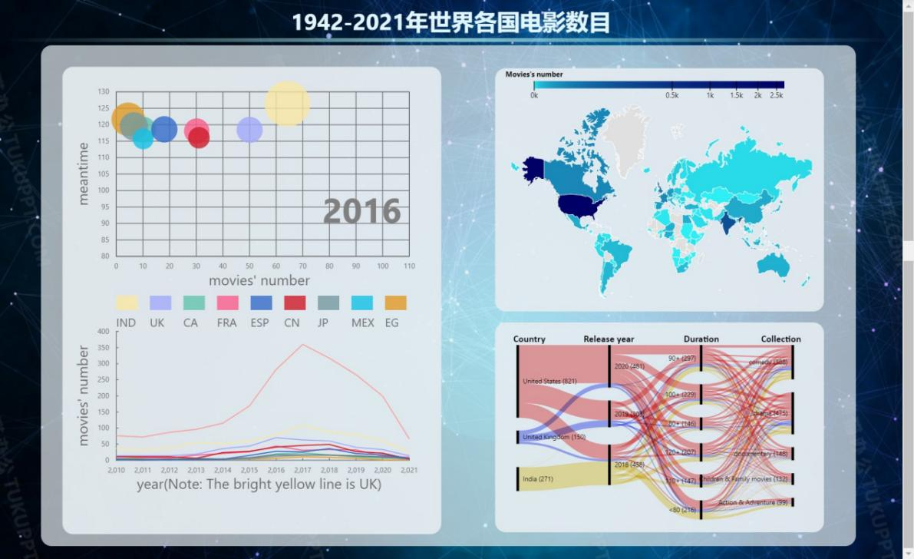
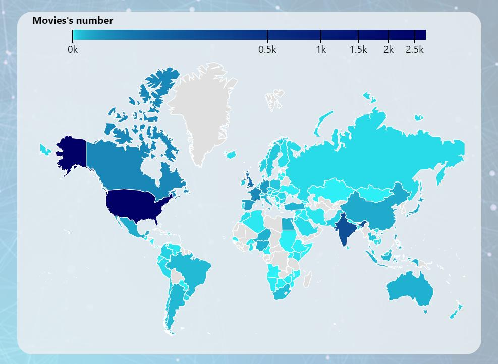
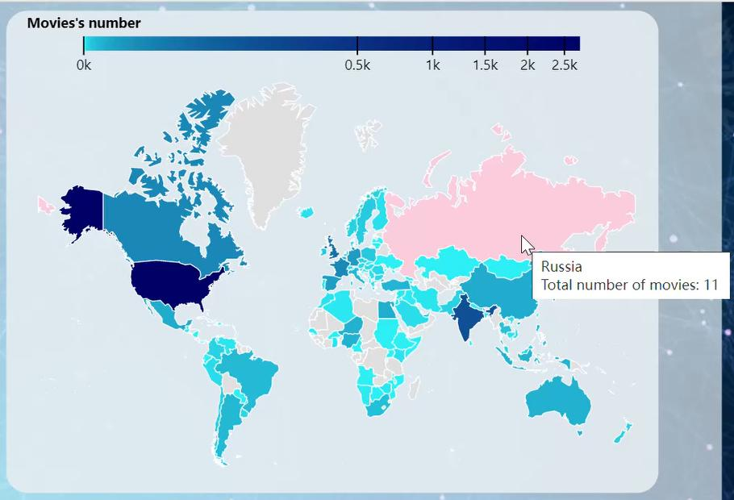
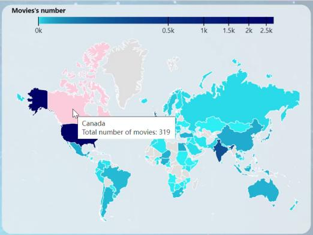
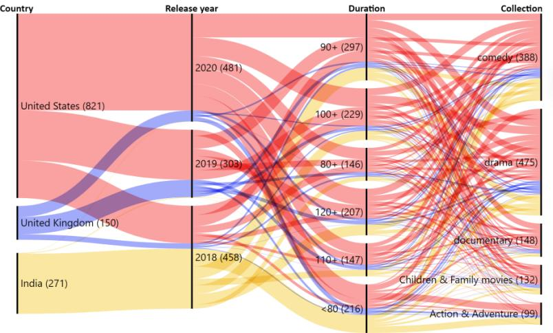
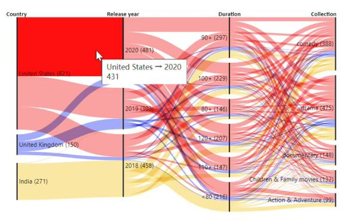
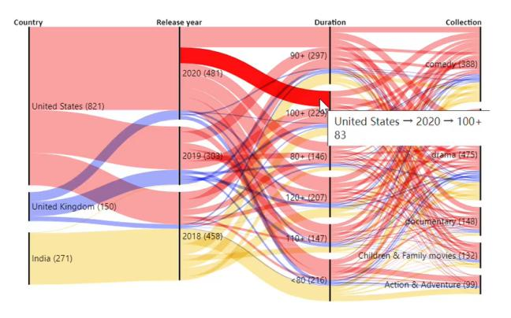
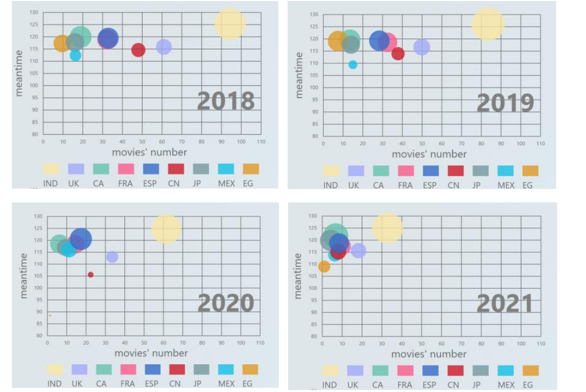
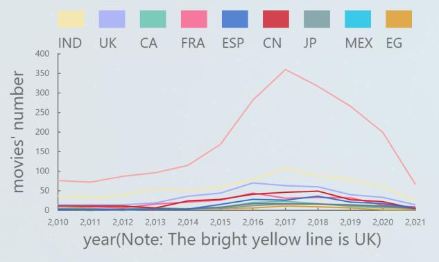

# Interactive-world-movie-review-webpage
Visualizasion of movie data(data from Kaggle)

## Visualization and Analysis

### World Map

#### 1. Color Mapping
To visualize the number of films produced in each country, we used color mapping. Since the distribution is highly skewed (with a few countries producing significantly more films than others), a simple linear color scale would make the differences in similar values hard to distinguish. Therefore, we applied `scaleOrdinal` to map film production quantities to distinct colors.

#### 2. Interactive Design
When hovering over a country, a tooltip displays the country's name and the total number of films produced between 1942 and 2021.

### Parallel Sets Visualization

#### 1. Visual Mapping
The Parallel Sets diagram shows film production data for the top three countries between 2018-2020, segmented by genre and film duration. The colors represent different countries (e.g., pink for the US, blue for the UK, and yellow for India), and the width of each path corresponds to the size of the data it represents.

#### 2. Interactive Design
Hovering over a path highlights the flow, allowing users to see the transition between different attributes like country, release year, and genre.

#### 3. Case Study
The data reveals clear patterns: the US leads in total production, followed by India and the UK. Most films have a runtime of 90-110 minutes, with drama being the most common genre. In 2020, despite the pandemic, the US managed to increase its film production, whereas other countries like the UK and India experienced a decline.

### Dynamic Scatter Plot and Line Chart

#### 1. Data Analysis
The dynamic scatter plot shows a clear decline in film production from 2019 to 2021 across all countries, corresponding to the global impact of the COVID-19 pandemic. However, the average film duration remained relatively stable between 100-130 minutes. The line chart highlights that the US has consistently led the world in film production, with a significant margin compared to other countries.

#### 2. Interactive Design
The scatter plot is interactive, allowing users to pause the animation by hovering over the graph, making it easier to observe trends and data points.

#### 3. Comparative Design
To avoid overwhelming the scatter plot with the US data (which significantly outnumbers other countries), the US data is displayed separately in a line chart. This allows for a more meaningful comparison between other countries' film production data.

